#### Welcome to COMP3900 Group UNeverSleepWell!

*An amazing event management platform coming soon!*

# Setting VMware player station 16:

Set up VMware until you get to this page. (On COMP3900 webcms3 having guide about how to arrive this page.)

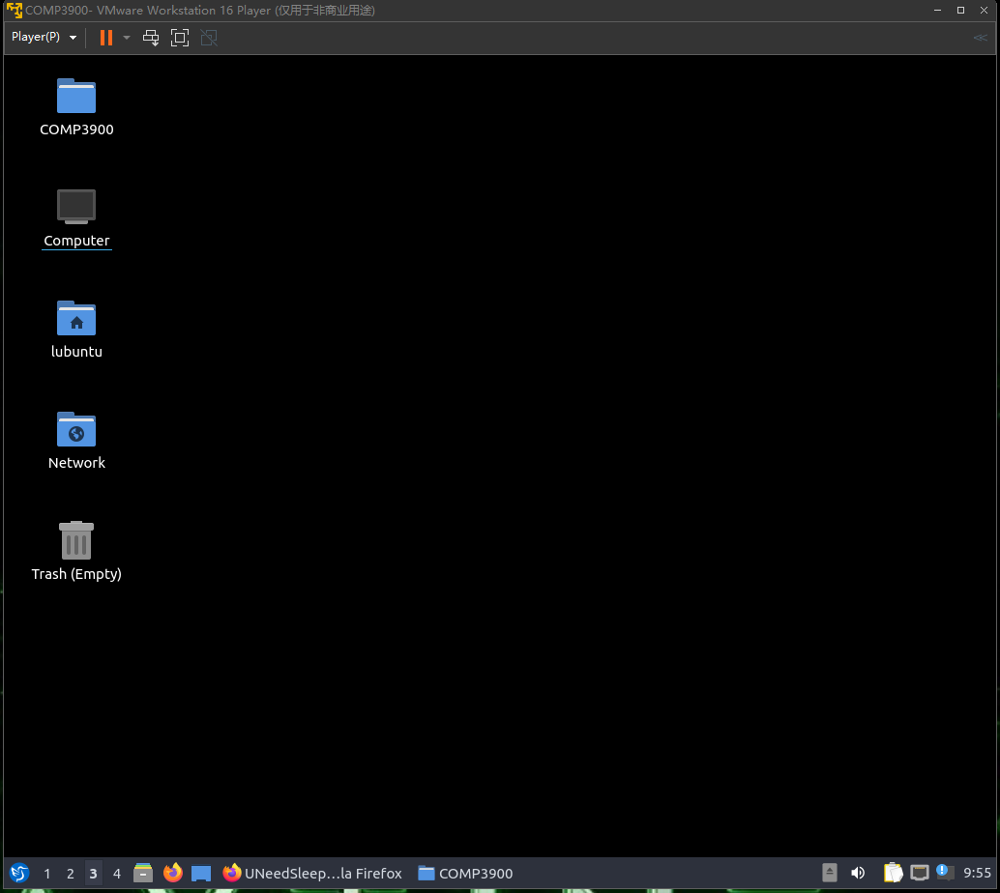 

Go to [https://github.com/unsw-cse-comp3900-9900-22T3/capstone-project-3900-m18b-uneversleepwell](https://github.com/unsw-cse-comp3900-9900-22T3/capstone-project-3900-m18b-u) and download the zip file (Use the account that has authority! Make sure you are a member of this project). Save it to Desktop, and also create a new folder called COMP3900. Then extract the zip file to the folder COMP 3900. After all this, the folder should look like this:

 !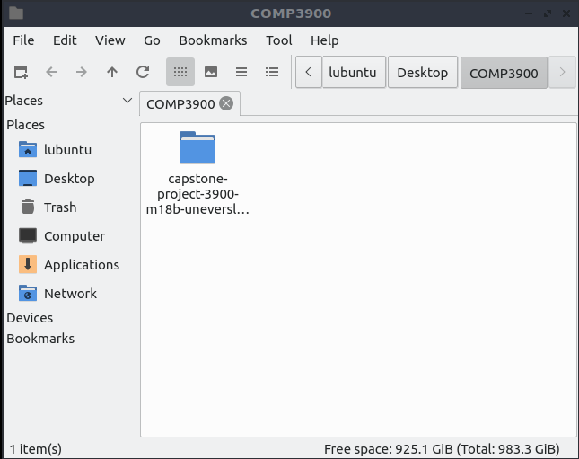 

Click into capstone project-3900-m18b-uneversleewell, and select mysql.sh and npmstart.sh these two files, copy and paste them to the upper level directory (below):

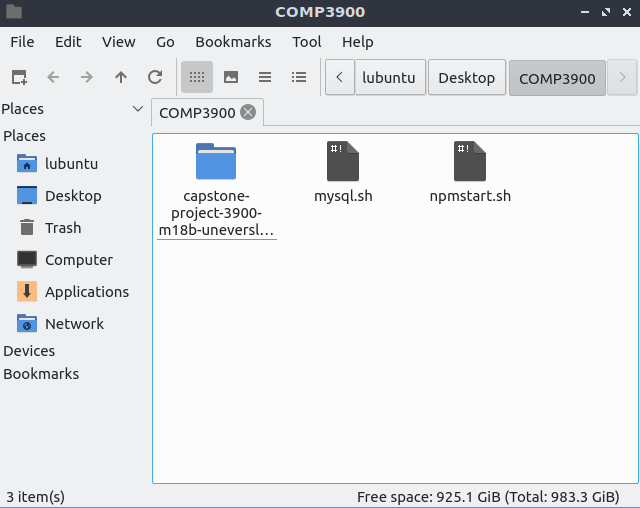 

Then open the terminal, enter sudo su and the password (lubuntu).

Next, go to folder COMP3900:

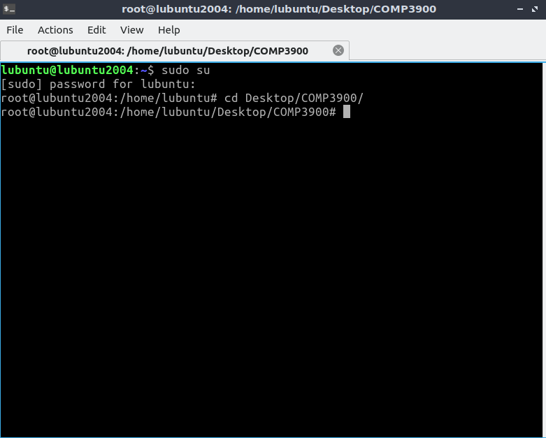 

Run 

```shell
sh mysql.sh
```

 first to install all the requirements for MySQL. (In the installation, you need to enter ‘Y’ manual) After this script finished, it should show like this:

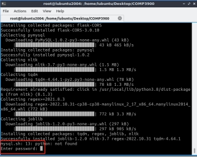) 

Enter any random password you want at this moment, and you will enter MySQL successfully. Therefore, enter the following commands to change the root password of MySQL:

```mysql
select user, plugin from mysql.user;

ALTER USER ‘root’@’localhost’ IDENTIFIED WITH mysql_native_password by ‘0000’;

flush privileges;

exit;
```

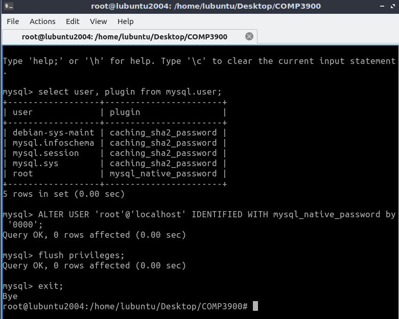 

At this point, you are good to go with MySQL. The next thing to is to install React environment, run 

```shell
sh npmstart.sh
```

 to complete React installation.

When you run sh npmstart.sh, it should return error or get stuck at some point, don’t worry, just run 

```shell
sh npmstart.sh
```

 again, the problem will be solved (Error showed above). The problem might be network problem.

(Error you might see)

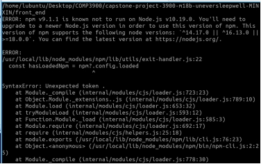 

(Here you might get stuck)

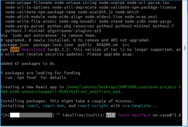 

When you see the diagram below, it means React was installed successfully. 

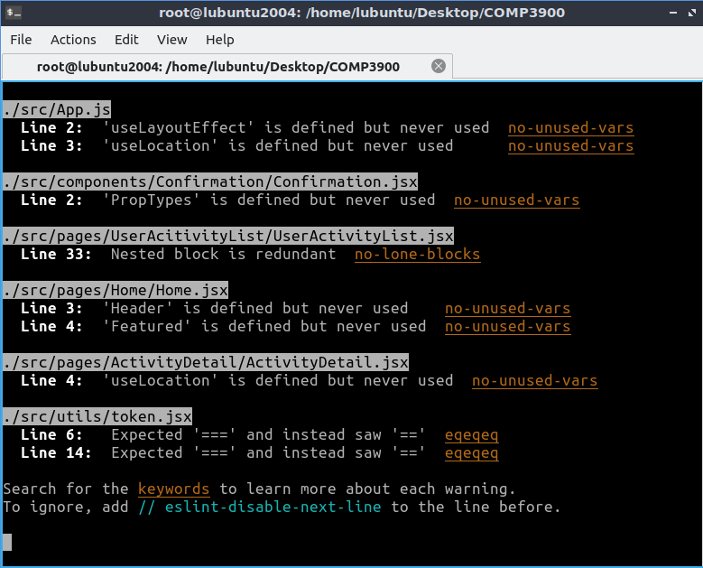 

The next thing you need to do now is open another terminal and go to the back-end file to start Server:

```python
python3 Server.py
```

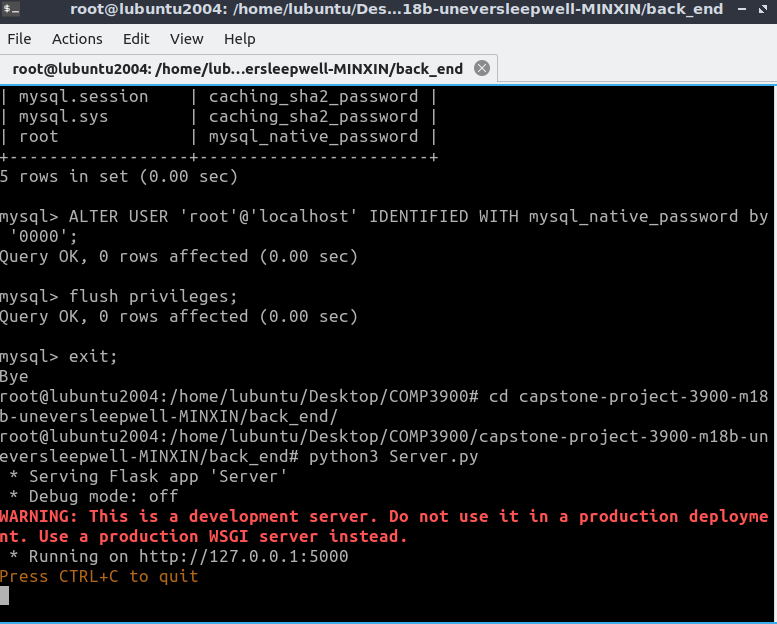 

And then you can go to fire fox and type “localhost:3000” to see the website finally.

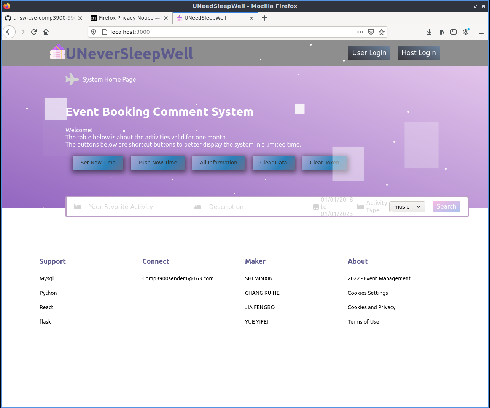 

 

# Setting on window:

https://www.mysql.com/cn/downloads/ or https://downloads.mysql.com/archives/installer/

Download a stable version of mysql, set passport as 0000(or you can change it in begin.py as you like).

https://nodejs.org/en/blog/release/v16.17.1/

Download a stable version of node (best 16).

Use the following instructions in our project directory:

```shell
sh windowsh.sh
```

（If your window does not recognize "sh", that is because you need to install 'git', go to https://git-scm.com/downloads 	and install 'git'）

```
npx create-react-app filename(you can choose)
```

```
cd filename(you can choose)
```

Move the files in front end in to this file(filename).

```
npm install
```

```
npm i @mui/lab @mui/material
```

```
cd back_end

python3 back_end/Server.py

cd ..

cd filename

npm start
```


It is worth noting that our system has both front-end tests and back-end tests. The coverage report of our back-end tests can be run according to the following instructions. First we go to the back-end folder. Then run those instructions.

```
coverage run -m pytest

coverage html
```

Wrote HTML report to htmlcov\index.html

For the front end, please go to the front-end folder and run those two  instructions on different terminals.

```
npm start

npm run sypress 
```

Then select the first E2E test according to the pop-up page. Then choose a browser to run the test, you can see that we have several test folders. Run these test folders to see our front-end tests.

